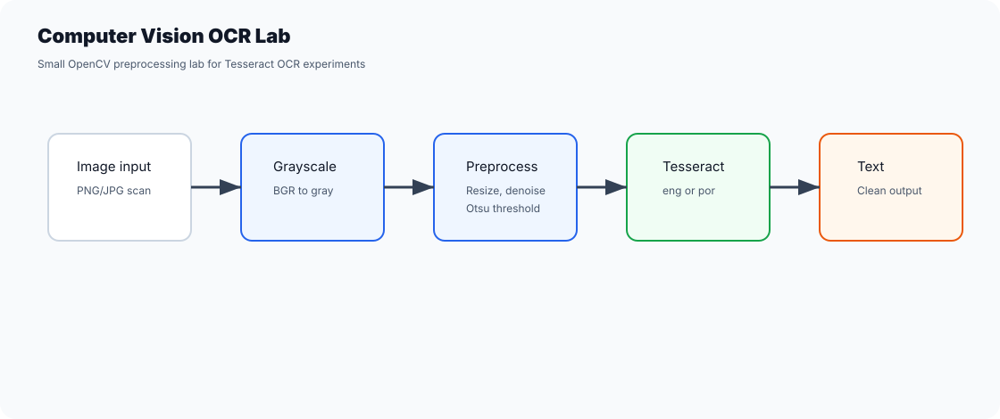

# Computer Vision OCR Lab

Small OpenCV + Tesseract OCR lab with a clean CLI, preprocessing helpers, tests and safe sample assets.



This repo is a portfolio-ready rebuild of an older OCR learning project. It keeps the useful computer-vision ideas while removing machine-specific paths and private sample files.

## What It Shows

- Image loading with OpenCV.
- BGR to grayscale conversion.
- Resize, median denoise and Otsu threshold preprocessing.
- Optional Tesseract OCR wrapper.
- CLI entrypoint.
- Automated tests for preprocessing behavior.
- GitHub Actions CI.

## Setup

Install Tesseract OCR locally if you want to run real OCR. For Portuguese OCR, install the `por` language data.

Then:

```bash
python -m venv .venv
.venv\Scripts\activate
python -m pip install -r requirements.txt
```

If Tesseract is not on your PATH, set:

```bash
set TESSERACT_CMD=C:\Program Files\Tesseract-OCR\tesseract.exe
```

## Run

```bash
python -m ocr_lab.cli sample_images/sample-text.pbm --lang eng
```

For Portuguese OCR:

```bash
python -m ocr_lab.cli path/to/image.png --lang por
```

## Test

The test suite does not require the Tesseract binary. It validates the OpenCV preprocessing helpers.

```bash
pytest
```

## Portfolio Notes

This is intentionally small and easy to inspect. It demonstrates image preprocessing, dependency boundaries and how to turn a quick Tkinter/Tesseract experiment into a cleaner public repository.
